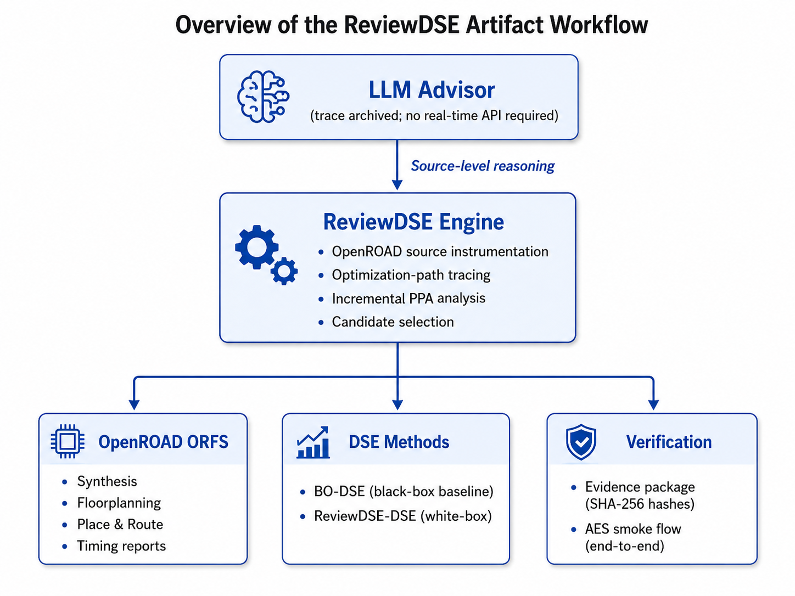

# DPLEvolve Artifact Evaluation

Artifact for **“From Tool Invocation to Source-Mechanism Exploration:
Protected White-Box DSE for Open-Source EDA.”**

This repository is organized around the paper experiments. Its primary job is
to let a reviewer execute the protected detailed-placement evaluator, reproduce
the default and BO baselines, rebuild and replay the selected ReviewDSE source
programs, and—when API access and budget are available—rerun the Teacher/Student
search itself.

`make audit-archive` is only a quick integrity check of packaged records. It is
not presented as experimental reproduction. The optional AES smoke command is
only a toolchain diagnostic and is not a paper experiment.

## What is reproducible

| Paper result | Fresh command | What the command actually executes |
|---|---|---|
| Table 4 default | `make reproduce-default` | OpenROAD default DPL on all nine target ODBs |
| Table 4 BO | `make reproduce-bo` | 400 Optuna-TPE trials per target, four trials in parallel |
| Table 4 ReviewDSE-HPWL | `make replay-reviewdse TRACK=hpwl` | Builds nine frozen selected source trees and runs their complete DPL trajectories |
| Table 4 ReviewDSE-GHR | `make replay-reviewdse TRACK=ghr` | Builds and runs the nine runtime-aware selected source trees |
| Table 5 | `make reproduce-table5` | Rebuilds AES/JPEG inputs and replays six candidates after the missing sources and SWERV DENSE_2 config are recovered |
| Table 6 | `make reproduce-table6` | Replays Diamond, Negotiation, and one frozen ReviewDSE source on nine exact cut-row DEF/V/SDC inputs |
| Figure 4 | `make reproduce-figure4` | Redraws the 9 × 11 best-so-far trajectories from checksummed author-run logs |
| Figure 5 | `make reproduce-figure5` | Recomputes both BO/ReviewDSE Pareto panels using runtime ratio on the x-axis |
| Ariane diagnostic | `make reproduce-ariane-diagnostic` | Rebuilds and replays the six exact source trees behind the warm-start diagnostic |
| ReviewDSE Level 1 | `make reproduce-level1` | Runs the three calibration instances and freezes reviewed mechanism/source-start evidence |
| ReviewDSE Level 2 | `make run-dse-small` / `make run-dse-paper` | Runs the target Teacher/Student source-edit, build, evaluate, and review loop |

`make reproduce-paper-results` is the complete no-LLM result orchestrator: it
checks external data first, then executes Table 4, Table 5, and Table 6. It is
not a shortcut to archived numbers. At present it stops at the documented
Table 5 recovery gate; run Table 4 and Table 6 independently. `make reproduce-paper-search
ACKNOWLEDGE_LLM_COST=yes` executes Level 1 followed by the full Level 2 search.

`make reproduce-available-results` is the current executable aggregate. It
runs fresh Table 4, Table 6, and the six-source Ariane diagnostic, then redraws
Figures 4/5 from checksummed retained author-run logs. It deliberately excludes
Table 5 and says so in the target. The retained figure command reconstructs
plotted author data; it is not a fresh rerun of the LLM search.

Important current data status: Table 4 selected sources are included and its
inputs are regenerated from the pinned flow. Table 6's exact DEF/Verilog/SDC
inputs and its single evolved source survived; a validated 200 MB external data
archive can drive all 27 fresh OpenROAD runs. For Table 5, the AES and JPEG
dense inputs have retained generation recipes, but the untracked SWERV
`config_dense2.mk` and all six paper-time source commits are absent from both
the original workspace and retained backup. `make reproduce-table5` therefore
blocks honestly until another backup is found. A retained SWERV handoff ODB is
not presented as an exact substitute because it was rewritten with a later SDC.
See [paper-data status and layout](docs/paper-data-layout.md).

## Paper experiment being reproduced



The evaluation target is OpenROAD **detailed placement**, starting from
`3_4_place_resized.odb`; it is not an RTL-to-GDS experiment. Every candidate is
rebuilt and run through the protected evaluator, which records:

- incoming global-placement HPWL, `H_g`;
- post-legalization HPWL, `H_lg`;
- post-DPO HPWL, `H_ip`;
- final post-DPL HPWL after final processing, `H_f`;
- strict legality, average/maximum displacement, runtime, liveness, and
  source/binary/metric consistency.

The machine-readable experiment contract is
[`configs/reproduction/paper-experiments.json`](configs/reproduction/paper-experiments.json).
It records the nine targets, Level 1 calibration cases, BO budget, model
profiles, iteration count, selection tracks, and Table 5/6 stress patterns.

## 1. Prepare the environment

The authors ran the experiments on Rocky Linux 8.10 x86-64 with two Intel Xeon
Platinum 8462Y+ CPUs (64 physical/128 logical cores total), 314 GiB RAM, and a
22 TiB `/home` filesystem. No GPU or commercial EDA license is required.

That is the measured reference machine, not a claim that every command consumes
all 314 GiB. OpenROAD alone can exceed 2 GiB even on modest cases; compilation,
parallel BO, large Ariane/SWERV/BPQUAD cases, and concurrent agent evaluations
need substantially more headroom. We therefore do not advertise the previous
8/16 GiB RAM or 10 GiB disk configuration as sufficient for full reproduction.
For planning, use a server-class Linux host, start with at least tens of GiB of
RAM and ample local disk, reduce parallelism on smaller machines, and monitor
actual peak memory on the selected cases.

```bash
git clone https://github.com/yuan-fd/DPLEvolve-AE.git
cd DPLEvolve-AE

make doctor
make bootstrap
make build-tools THREADS=16
make prepare-paper-inputs THREADS=16
make validate-evaluator CASE=aes_nangate45 THREADS=8
```

`bootstrap` checks out the recorded ORFS/OpenROAD revisions and applies the
tracked DPLEvolve patches. `build-tools` builds pinned Yosys/OpenROAD. Input
preparation runs the real ORFS place target for the nine designs. The evaluator
validation then runs the canonical DPL lines and emits new `metrics.json`
records containing the full stage trajectory.

The setup scripts never invoke `sudo`. On Rocky Linux, run `make doctor` and
ask the system administrator to install only the missing build packages it
reports. Exact repository revisions are in
[`provenance/source-commits.json`](provenance/source-commits.json).

## 2. Reproduce Table 4

Run one target first:

```bash
make reproduce-default CASE=aes_nangate45 THREADS=8
make setup-bo
make reproduce-bo CASE=aes_nangate45 THREADS=8
make replay-reviewdse CASE=aes_nangate45 TRACK=hpwl THREADS=8
make replay-reviewdse CASE=aes_nangate45 TRACK=ghr THREADS=8
```

Then run all nine cases:

```bash
make reproduce-table4 THREADS=10
```

`setup-bo` creates the isolated Ray Tune/Optuna environment used only by the BO
baseline. This is a large run: BO alone executes 9 × 400 fresh placements. Outputs go
under `DPL_EVOLVE_STATE_ROOT` and ORFS `flow/reports/`; they are not written
over the archived expected values. The frozen-source replay does not call an
LLM, but it does compile and execute each selected C++ source program. After
all nine cases finish, `summarize-table4` writes
`$DPL_EVOLVE_STATE_ROOT/paper_reproduction/table4/table4-fresh.tsv` directly
from the new default `metrics.json`, BO `best.json`, and replay `results.tsv`.

Regenerated ODBs are used with the stable `paper9_place` flow variant. Exact
paper-time ODBs can instead be installed under the variant in the selected
program manifest. The AES Nangate45 input is checksum-pinned; input checksums
for the other eight cases still need to be added before claiming bit-exact
paper-input identity.

This does not prevent scientific reproduction. For those eight cases the
runner requires a complete, legal fresh result, reports absolute-HPWL drift as
diagnostic information, and lets `summarize-table4` judge relative deltas and
runtime ratios. The default acceptance windows are 0.06 percentage point for
HPWL delta and 0.20 for runtime ratio. Only checksum-pinned AES Nangate45 uses
the strict 0.05% absolute-HPWL replay check.

## 3. Reproduce Figures 4/5 and the Ariane diagnostic

```bash
make reproduce-figures FIGURE_SOURCE=retained
make check-ariane-diagnostic-sources
make reproduce-ariane-diagnostic THREADS=10
```

Figure 4 emits exactly 99 normalized points: nine cases and iteration 0 through
10, with best-so-far carry-forward. Figure 5 requires 400 BO trials for each of
AES N45 and Ariane133 N45, uses `runtime_ratio` as its horizontal coordinate,
and recomputes the Pareto frontier. SVG and TSV products are written under
`$DPL_EVOLVE_STATE_ROOT/paper_reproduction/figures/`, outside Git.

The Ariane command replays four sources that missed the handoff mechanism and
two Level-1-guided sources, then derives both group means from fresh metrics.
It is diagnostic context, not a controlled ablation. Its paper-time ODB hash
did not survive, so this path uses a pinned-flow reconstruction and does not
claim bit-for-bit input identity.

## 4. Run the ReviewDSE method

The paper method first constructs frozen global evidence on three calibration
instances (JPEG N45 UTIL=90, AES N45 UTIL=70, and SWERV N45 UTIL=60):

```bash
make plan-level1
make reproduce-level1 ACKNOWLEDGE_LLM_COST=yes LEVEL1_CHILDREN=50 THREADS=10
```

This generates a read-only Level 1 packet that the Level 2 launcher copies into
every target context. The main paper does not disclose Level 1 Student breadth;
50 is the framework's documented public breadth-calibration profile, not an
assertion about the unrecovered author run. The author-time value must be added
to the AE appendix/configuration before claiming exact search-process
reproduction.

A small run exercises the actual method rather than inspecting a final binary:

```bash
make run-dse-small CASE=aes_nangate45 STUDENTS=1 ITERATIONS=1 THREADS=8
```

It creates a Teacher, gives a Student a private source workspace, applies a
source edit, builds a private OpenROAD variant, evaluates the complete flow,
and returns the evidence to Teacher review. It requires a working Codex/API
configuration and incurs model usage.

The exact paper launch is deliberately cost-gated:

```bash
make plan-dse-paper
make run-dse-paper ACKNOWLEDGE_LLM_COST=yes DSE_RUN_PREFIX=review_run_01 THREADS=10
make reproduce-figures FIGURE_SOURCE=fresh DSE_RUN_PREFIX=review_run_01
```

The paper protocol is one GPT-5.5 xhigh Teacher, four GPT-5.4 xhigh Students,
10 iterations per target, and a 2× runtime gate. The paper reports a mean of
2.15 billion logged tokens and 0.10 billion active tokens per target; over nine
targets that is about 19.35 billion logged and 0.90 billion active tokens. A
reviewer is **not required** to pay for this full search. The artifact must,
however, contain the runnable full-search path and all non-LLM replay paths.

## 5. Reproduce Tables 5 and 6

Download and verify the retained Table 6 package:

```bash
make fetch-table6-data
make check-table6-data
```

The fixed asset URL is
`https://github.com/yuan-fd/DPLEvolve-AE/releases/download/paper-data-v1/dplevolve-table6-paper-data-20260722.tar.gz`;
its SHA-256 is
`c73f84c6008ddf578bce9c2708dbe1eff55b2a8e96dada95376369afe9008b63`.
While the repository is private, collaborators need an authenticated GitHub
CLI session (`gh auth login`); `make fetch-table6-data` automatically falls
back from anonymous `curl` to `gh release download`. No authentication is
needed after the repository becomes public.
Then run:

```bash
make reproduce-table6 THREADS=10
```

This executes 27 OpenROAD jobs from the retained cut-row DEF/Verilog/SDC data,
with the paper's 7200-second cap on every legalizer. The same single evolved
source is rebuilt once and replayed on all nine patterns. Reviewers do not need
Innovus: the exact `cutRow` products are inputs, while all replay execution is
OpenROAD.

Run one real row first if desired:

```bash
make reproduce-table6 CASE=ariane133_placebatch PATTERN=center_band_8 ROLE=reviewdse THREADS=10
```

Table 5's recoverable placement inputs are prepared separately:

```bash
make prepare-table5-inputs THREADS=10
make reproduce-table5 THREADS=10
```

Both commands currently report `BLOCKED` before EDA execution because the
paper-time SWERV `config_dense2.mk` is missing; the full replay additionally
needs the six missing source commits. They become executable without code
changes if those files are recovered into the documented layout.

To execute every non-LLM result experiment in order:

```bash
PAPER_DATA_ROOT=/path/to/paper-data make reproduce-paper-results THREADS=10
```

This aggregate command intentionally exits before the expensive Table 4 BO
campaign while Table 5 recovery data is missing. Today, use `make reproduce-table4`
and `make reproduce-table6` as the complete runnable result paths and report
Table 5 as the known artifact gap.

For the currently available subset, use:

```bash
PAPER_DATA_ROOT=/path/to/paper-data make reproduce-available-results THREADS=10
```

Table 5 reruns the legalization-selected candidate and its full-flow reference,
then compares `H_lg` with downstream `H_ip`/`H_f`. Table 6 loads each exact
cut-row DEF/Verilog/SDC and executes fixed Diamond, fixed Negotiation, and the
reported ReviewDSE repair source using the same legality checker and timeout.
Neither command reads archived expected JSON as an experimental result.

## Supporting audit and diagnostic commands

```bash
make audit-archive       # seconds; recomputes packaged Table 4/5/6 records
make toolchain-smoke     # optional AES toolchain diagnostic
make test
```

`make evidence` remains only as a compatibility alias for
`make audit-archive` and prints that limitation. Archived records are useful
for provenance and quick review, but agreement between a TSV and the paper is
not reproduction.

## Repository layout

```text
DPLEvolve-AE/
├── configs/reproduction/     # paper-derived execution manifest and case plans
├── scripts/reproduce/        # public fresh-experiment entry points
├── src/dpl_evolve_agent/     # protected evaluator and Teacher/Student framework
├── artifacts/                # archived records and 18 frozen Table 4 source trees
├── docs/                     # environment, data, and reviewer guidance
├── images/                   # repository figures
├── provenance/               # pinned source revisions
├── tests/                    # command/manifest/evaluator regression tests
└── web-demo/                 # optional browser frontend to the same Make targets
```

The command overview is always available with `make help`.
