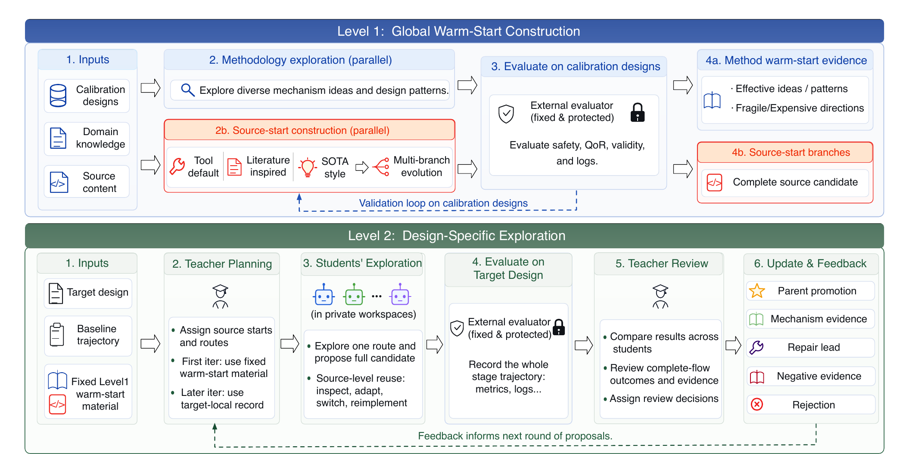

# From Tool Invocation to Source-Mechanism Exploration: Protected White-Box DSE for Open-Source EDA

A protected white-box design-space exploration framework for source-level
mechanisms in OpenROAD detailed placement.

[Paper link](https://arxiv.org/abs/2607.11294)

[Paper with Artifact Appendix](paper/artifact_evaluation.pdf)

[Demo Video (1 minute 49 seconds)](https://github.com/yuan-fd/DPLEvolve-AE/releases/download/demo-video-v1/RiviewDSE-demo.mp4)



## Code Structure

```text
DPLEvolve-AE/
├── artifacts/
│   ├── 01-table4-qor/                 # Table 4: default, BO, ReviewDSE-HPWL/GHR
│   │   ├── README.md                  # Experiment instructions
│   │   ├── reproduce.sh               # Complete Table 4 entry point
│   │   ├── config/                    # Baseline, BO, and search configurations
│   │   ├── inputs/                    # Retained experiment inputs
│   │   ├── selected-programs/         # 18 HPWL/GHR source programs
│   │   ├── expected/                  # Numerical acceptance values
│   │   └── output/                    # Output contract
│   ├── 02-table5-composability/       # Table 5: stage composability
│   ├── 03-table6-cutrow/              # Table 6: hard cut-row legality
│   ├── 04-figures/                    # Figures 4 and 5
│   ├── 05-reviewdse-search/           # Level 1 and Teacher/Student search
│   └── 06-ariane-diagnostic/          # Ariane source-mechanism diagnostic
├── scripts/
│   ├── human/                         # Environment setup scripts
│   ├── reproduce/                     # Experiment runners and evaluators
│   ├── agent/                         # Fixed agent-facing execution scripts
│   ├── shared/                        # Shared runtime utilities
│   └── maintenance/                   # Release and provenance scripts
├── configs/reproduction/              # Paper experiment configurations
├── paper/artifact_evaluation.pdf       # Paper PDF with the Artifact Appendix
├── paper-data/                        # Downloaded Table 6 inputs
├── src/dpl_evolve_agent/              # ReviewDSE implementation
├── docs/                              # Human-facing detailed documentation
├── agent/                             # Agent-facing rules and task recipes
├── tests/toolchain/aes-smoke/         # Non-paper EDA toolchain test
├── web-demo/                          # Browser interface to fixed commands
├── Makefile                           # Root command interface
└── LICENSE
```

## Dependencies

- [Python](https://www.python.org/) 3.11 or newer

  - PyYAML 6.0.3 is installed automatically by the setup script.

- [GCC/G++](https://gcc.gnu.org/) 9 or newer

- [CMake](https://cmake.org/) 3.16 or newer

- Bison, Flex, SWIG, Tcl/Tk, Boost, Eigen, spdlog, zlib, and libffi

  - These are standard OpenROAD build dependencies.

- [OpenROAD-flow-scripts](https://github.com/The-OpenROAD-Project/OpenROAD-flow-scripts)

- [OpenROAD](https://github.com/The-OpenROAD-Project/OpenROAD)

- [Yosys](https://github.com/YosysHQ/yosys) 0.64

- [yosys-slang](https://github.com/povik/yosys-slang)

  - The exact EDA source revisions are recorded in
    [`provenance/source-commits.json`](provenance/source-commits.json) and are
    prepared by `make bootstrap` and `make build-tools`.

- [Ray Tune](https://docs.ray.io/en/latest/tune/) 2.31.0,
  [Optuna](https://optuna.org/) >= 3.6 and < 5.0, and
  [NumPy](https://numpy.org/) >= 1.26 and < 2.0 (Table 4 BO only)

  - Installed by `make setup-bo`.

## 1. Install the Environment

Review the host and filesystem checklist in [docs/requirements.md](docs/requirements.md).

```bash
git clone https://github.com/yuan-fd/DPLEvolve-AE.git
cd DPLEvolve-AE

# Check the host and print missing dependencies
make doctor

# Fetch and build the pinned ORFS, OpenROAD, and Yosys revisions
make bootstrap
make build-tools THREADS=8

# Generate the nine paper placement inputs
make prepare-paper-inputs THREADS=8
```

## 2. Run the Experiments

### Table 4: QoR and Runtime

```bash
# Nine defaults, 3,600 BO trials, and 18 selected-source replays
bash artifacts/01-table4-qor/reproduce.sh --threads 10
```

Result:

```text
../dpl_evolve_state/paper_reproduction/table4/table4-fresh.tsv
```

### Table 5: Stage Composability

The artifact retains one checksummed source snapshot for each of LEGALM,
Diamond, and Negotiation. The Table 5 runner maps the six selected/reference
roles to those three implementations and regenerates the AES, JPEG, and SWERV
inputs with local `CORE_UTILIZATION` values 70, 90, and 60, respectively.

```bash
make check-table5-data
make reproduce-table5 THREADS=10
```

Fresh comparisons are written to
`../dpl_evolve_state/paper_reproduction/table5_*/table5-fresh.tsv`. See
[docs/table5-status.md](docs/table5-status.md) for the exact role mapping.

### Table 6: Hard Cut-Row Legality

```bash
# Download the experiment inputs, then execute all 27 runs
bash artifacts/03-table6-cutrow/reproduce.sh --fetch --threads 10
```

Result:

```text
../dpl_evolve_state/paper_reproduction/table6_*/table6-fresh.tsv
```

### ReviewDSE Search

```bash
# Inspect the configured Level 1 and nine-case search plans
bash artifacts/05-reviewdse-search/reproduce.sh --plan

# Run one Teacher/Student iteration
bash artifacts/05-reviewdse-search/reproduce.sh \
  --small --case aes_nangate45 --threads 8

# Full paper search: requires authenticated Codex/API access and the
# paper-scale token budget.
bash artifacts/05-reviewdse-search/reproduce.sh \
  --level1 --acknowledge-cost --threads 10
bash artifacts/05-reviewdse-search/reproduce.sh \
  --paper --run-prefix review_run_01 --acknowledge-cost --threads 10
```

Result:

```text
../dpl_evolve_state/experiment_batches/review_run_01_paper9_place/
```

### Figures 4 and 5

```bash
# Rebuild from retained paper-search logs
bash artifacts/04-figures/reproduce.sh

# Rebuild from the fresh search above
bash artifacts/04-figures/reproduce.sh \
  --fresh --run-prefix review_run_01
```

Results:

```text
../dpl_evolve_state/paper_reproduction/figures/retained/
../dpl_evolve_state/paper_reproduction/figures/fresh/
```

### Ariane Diagnostic

```bash
bash artifacts/06-ariane-diagnostic/reproduce.sh --threads 10
```

Result:

```text
../dpl_evolve_state/paper_reproduction/ariane_diagnostic_*/ariane-diagnostic-fresh.tsv
```

## 3. Evaluate the Results

The experiment scripts evaluate each fresh run before returning success. Table
4 can be summarized again after its runs complete:

```bash
make summarize-table4
```

All summaries, legality reports, metrics, and generated figures are
written under:

```text
../dpl_evolve_state/
├── paper_reproduction/
│   ├── table4/table4-fresh.tsv
│   ├── table6_*/table6-fresh.tsv
│   ├── figures/{retained,fresh}/
│   └── ariane_diagnostic_*/ariane-diagnostic-fresh.tsv
└── experiment_batches/<RUN_PREFIX>_paper9_place/
```

## Web Demo

Start the browser interface from the repository root:

```bash
bash web-demo/start.sh
```

Open `http://127.0.0.1:8080`. The Web Demo provides visual controls and live
logs for the same environment setup, experiment reproduction, and result
evaluation commands described above. It can be used in place of the terminal
Make commands.

For a remote evaluation server, run the following command on the local machine
and then open the same address in the local browser:

```bash
ssh -N -L 8080:127.0.0.1:8080 USER@SERVER
```
