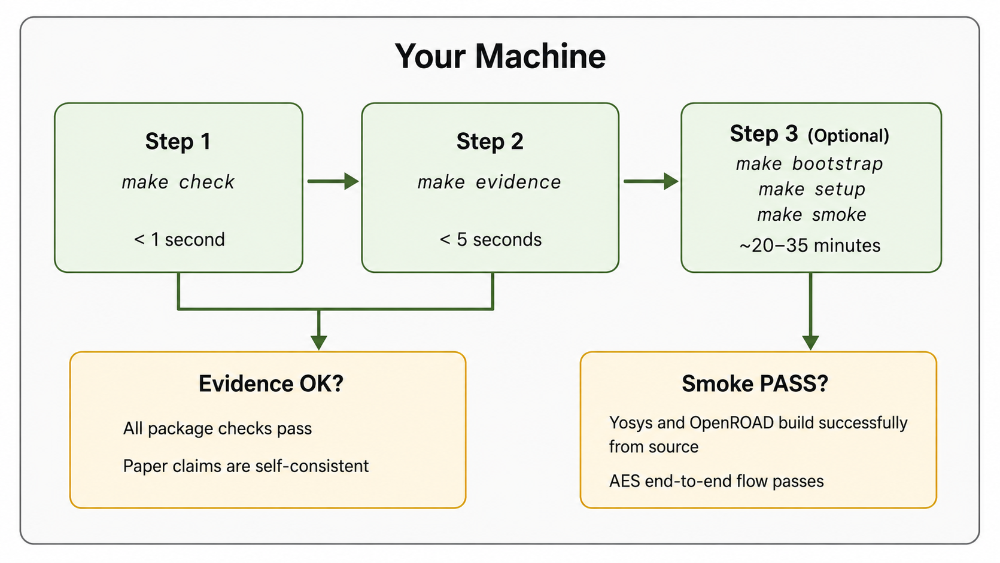

# DPLEvolve: Artifact Evaluation（可复现性评估）

[](https://mlcad.org/)
[](LICENSE)

**论文:** "From Tool Invocation to Source-Mechanism Exploration:
Protected White-Box DSE for Open-Source EDA"

**Artifact 版本:** v1.0.0 &nbsp;|&nbsp; **DOI:** [待填写]

---

## 作者与联系方式

[待填写]

**项目负责人:** [待填写]
**联系:** [待填写]

---

## 概述

传统的设计空间探索（DSE）将 EDA 工具视为黑盒：输入参数，输出 QoR 数字，
无法解释*为什么*某个配置优于另一个。

DPLEvolve 采用不同的思路。它读取 OpenROAD 源码，在个别优化 pass 上插桩，
追踪从每次变换到 PPA 影响的因果链。结果是白盒 DSE：你不仅知道"参数 X 效果更好"，
还知道它更好是*因为*在 CTS 后的缓冲阶段减少了线长。

本 artifact 包含：

- **ReviewDSE 框架的源代码**
- **所有论文图表对应的预计算实验 trace**
- **AES smoke flow**——可以在你的机器上全新执行一次 RTL-to-GDS 流程
- **每个证据包的 SHA-256 完整性校验**

打包结果可在数秒内验证；从源码运行完整 AES smoke flow 大约需要半小时。

---

## 架构


流水线分为六个阶段：

1. ORFS 对每个设计进行综合和布局规划，输出 ODB 快照。
2. BO-DSE（基线方法）在工具暴露的参数空间内进行盲搜索。
3. ReviewDSE（本方法）插桩 OpenROAD 源码，追踪每次优化的机制，
   以因果推理指导候选方案选择。
4. LLM 顾问将每个 QoR 变化归因到具体的代码路径。
   所有分析均归档为可读文本——评估阶段不需要任何 API 调用。
5. 证据包将所有论文声明与归档预期值交叉校验。不需要 GPU 或 EDA 许可证。
6. AES smoke flow 验证从源码到 GDS 的完整工具链。

---

## 验证流程



**第一步 — 环境检查**（< 1 秒）：确认 Python、GNU Make 和 Bash 的版本符合要求。

**第二步 — 证据验证**（< 5 秒）：将所有预计算结果与预期值交叉校验。
这是主要验证路径——确认打包证据与论文声明一致。

**第三步 — Smoke flow**（~20–35 分钟，可选）：从固定源码版本构建 Yosys 和
OpenROAD，然后对 AES（Nangate45）设计运行综合→布局规划→布局→布线全流程。
用以验证工具链在你的硬件上可以端到端工作。

---

## 目录结构

```
DPLEvolve-AE/
├── README.md                          # 本文档
├── Makefile                           # 所有入口点
├── dplevolve-architecture.png         # 架构图
├── dplevolve-verification-flow.png    # 验证流程图
│
├── artifacts/                         # 实验结果与证据
│   ├── 01-table4-qor/                 #   Table 4: QoR 对比
│   │   ├── expected/                  #     预期值（JSON，权威来源）
│   │   ├── traces/                    #     LLM 推理 trace（可读文本）
│   │   ├── selected-programs/         #     18 个源码树及 SHA-256 清单
│   │   └── output/                    #     生成的验证输出
│   ├── 02-table5-composability/       #   Table 5: 可组合性
│   ├── 03-table6-cutrow/              #   Table 6: Cut-row 模式
│   └── 04-aes-smoke/                  #   AES smoke flow
│
├── src/                               # ReviewDSE 源码
│   └── dpl_evolve_agent/              #   Agent 编排
│       ├── agent/                     #     核心 agent 循环
│       ├── adapters/                  #     工具与 API 适配器
│       ├── baseline/                  #     BO-DSE 基线实现
│       ├── calibration/               #     参数校准
│       ├── configs/                   #     Agent 与实验配置
│       ├── database/                  #     实验数据库
│       ├── experiments/               #     实验定义
│       ├── knowledge/                 #     领域知识库
│       ├── learning/                  #     学习与优化
│       ├── memory/                    #     Agent 内存管理
│       ├── scripts/                   #     Agent 执行脚本
│       ├── skills/                    #     Agent 技能定义
│       ├── tests/                     #     Agent 级测试
│       └── validation/                #     验证工具
│
├── docs/                              # 补充文档
│   ├── environment.md                 #   固定工具版本
│   ├── expected-results.md            #   预期值与容差
│   ├── troubleshooting.md             #   常见问题与解决
│   └── claims-to-artifacts.md         #   完整论文声明→命令映射
│
├── scripts/                           # 设置与辅助脚本
├── provenance/                        # 固定版本与校验和
│   └── source-commits.json            #   精确工具 commit hash
│
├── paper/                             # Camera-ready PDF
├── tests/                             # 结构与集成测试
└── agent/                             # CI/CD 自动化（包含，不审查）
```

---

## 论文—Artifact 映射表

论文中需要 artifact 支撑的每条声明如下。全部七条在干净 checkout 下均通过
`make evidence`。仅 C5 需要 EDA 工具，其余仅需 Python 标准库。

| ID | 论文位置 | 论文主张 | 命令 | 输入 | 预期输出 | 时间 / 硬件 |
|----|---------|---------|------|------|---------|------------|
| C1 | Table 4 | ReviewDSE-HPWL 相比 BO-DSE 基线降低 1.78% 线长 | `make table4` | `artifacts/01-table4-qor/` | CSV，各设计 QoR 指标与 Table 4 一致 | < 5 秒 / 任意 |
| C2 | Table 4 | ReviewDSE-GHR 降低 1.68% 全局布线溢出，1.11× runtime | `make table4` | `artifacts/01-table4-qor/` | 同上 CSV；GHR 列与 Table 4 一致 | < 5 秒 / 任意 |
| C3 | Table 5 | 3 个反例验证 ReviewDSE 可组合性 | `make table5` | `artifacts/02-table5-composability/` | 3 个 pass/fail 判定与 Table 5 一致 | < 1 秒 / 任意 |
| C4 | Table 6 | 9 个 cut-row repair 模式验证通过 | `make table6` | `artifacts/03-table6-cutrow/` | 9 个模式验证结果与 Table 6 一致 | < 1 秒 / 任意 |
| C5 | Sec. V-C | AES smoke flow: Nangate45 完整 RTL-to-GDS 可运行 | `make bootstrap && make setup && make smoke` | ~10 GB 磁盘，网络（仅 setup） | `[OK] AES smoke test PASSED` | setup ~10–30 分钟; smoke ~2–5 分钟 / Linux x86-64 |
| C6 | Table 4 | 18 个选定程序源码树可供审计 | `make table4` | `artifacts/01-table4-qor/selected-programs/` | 18 个源码树及 SHA-256 完整性清单 | < 5 秒 / 任意 |
| C7 | Sec. IV | ReviewDSE 源码 | 源码审查 | `src/` | Python 源码，含行内文档 | — |

---

## 硬件与软件要求

### 硬件

- **操作系统:** Linux x86-64（在 Ubuntu 20.04 / 22.04 上测试）
- **CPU:** 证据检查无要求；smoke flow 需 2+ 核（推荐 4 核）
- **GPU:** 不需要
- **内存:** 证据检查 < 1 GB；smoke 需 8 GB（推荐 16 GB）
- **磁盘:** 证据检查 ~1 GB；smoke 需 ~10 GB
- **网络:** 仅 setup 阶段需要（克隆仓库，约 2 GB 下载）
- **预计总耗时:** 证据检查秒级；smoke 约 10–30 分钟（setup）+ 2–5 分钟（smoke）

### 软件

**证据验证：**

- Python ≥ 3.11
- GNU Make ≥ 4.0
- Bash ≥ 4.0

证据检查不需要 pip 包、EDA 工具或 API key。

**Smoke flow（自动安装）：**

- Yosys 0.41（按 `provenance/source-commits.json` 中固定 commit 构建）
- OpenROAD v2.0（同上）
- 其余依赖由 `make bootstrap && make setup` 自动获取和编译。

### 环境变量

| 变量 | 默认值 | 说明 |
|------|--------|------|
| `DPL_EVOLVE_PYTHON` | `python3` | 覆盖 Python 解释器路径 |
| `SMOKE_THREADS` | `nproc` | Smoke 构建线程数 |
| `DPL_EVOLVE_THREADS` | `4` | Agent 派发运行线程数 |
| `ORFS_ROOT` | `../OpenROAD-flow-scripts` | 覆盖 ORFS workspace 路径 |
| `DPL_EVOLVE_STATE_ROOT` | `../dpl_evolve_state` | 状态目录（自动检测） |
| `DPL_EVOLVE_AGENT_ROOT` | `src/dpl_evolve_agent` | Agent 根目录（自动检测） |

---

## 快速上手

```bash
make check           # 检查环境：Python、Make、Bash
make evidence        # 验证所有打包结果与预期值一致
```

两条命令均通过即完成验证。`make evidence` 应输出：

```
[PASS] All packaged paper-evidence bundles passed
```

也可逐表验证：

```bash
make table4          # Table 4: QoR 对比
make table5          # Table 5: 可组合性
make table6          # Table 6: Cut-row 模式
```

---

## 完整复现：Smoke Flow

Smoke flow 从源码重新构建 Yosys 和 OpenROAD，对全新 AES 设计运行
综合→布局规划→布局→布线全流程。

```bash
make bootstrap       # 克隆固定版本的 Yosys 和 OpenROAD（~2 分钟）
make setup           # 从源码编译（~10–30 分钟，一次性）
make smoke           # 运行 AES RTL-to-GDS（构建后 ~2–5 分钟）
```

预期输出：`[OK] AES smoke test PASSED`

- `bootstrap` 按 `provenance/source-commits.json` 记录的精确 commit 克隆代码。
- `setup` 从这些 commit 编译两个工具。在典型机器上需要 10–30 分钟。
- `smoke` 对 AES（Nangate45）运行完整流程，将输出与
  `artifacts/04-aes-smoke/expected/ae_reproduction_lock.json` 中的 lock file 对比。

如仅需验证归档 smoke 结果而不重新运行：

```bash
make smoke-check
```

### 输出位置

| 命令 | 输出 |
|------|------|
| `make evidence` | 只读检查，无输出文件 |
| `make table4/5/6` | `artifacts/0X-*/output/` |
| `make smoke` | `artifacts/04-aes-smoke/output/` |
| `make clean` | 删除输出，保留证据 |

---

## 预期结果

权威参考来源为 `artifacts/*/expected/` 下的 JSON 文件。
以下提供近似值供参考。

| Bundle | 近似值 | 参考文件 |
|--------|-------|---------|
| BO-DSE | 平均 HPWL 降低约 0.38% | `artifacts/01-table4-qor/expected/table4.json` |
| ReviewDSE-HPWL | 降低约 1.78%，runtime 约 1.34× | `artifacts/01-table4-qor/expected/paper_claims.json` |
| ReviewDSE-GHR | 降低约 1.68%，runtime 约 1.11× | `artifacts/01-table4-qor/expected/paper_claims.json` |
| AES smoke | 精确值见 lock file | `artifacts/04-aes-smoke/expected/ae_reproduction_lock.json` |

在声明容差范围内的小幅偏差属于正常现象。

---

## 可复现性说明

### 包含的内容

Tables 4–6 的所有结果均有归档数据支撑，附带 SHA-256 完整性校验。
AES smoke flow 可从源码完全复现。

### 不包含的内容（及原因）

**ODB 输入文件（约 3 TB）。** 论文运行时的 9 个设计数据库体积过大，无法分发。
我们在 `provenance/source-commits.json` 中记录了精确的 OpenROAD 和 Yosys
commit hash，以及 RTL 源码。从相同 commit 重建可产生功能等效的 ODB。

**完整 LLM trace 重新生成（每个设计约 2B token）。** Table 4 中的 ReviewDSE
trace 由专有 LLM API 生成。从零重跑每个设计约需 $30–50，且需要实时 API 访问。
全部 18 个候选 trace 归档为可读文本，存放于 `artifacts/01-table4-qor/traces/`，
由 SHA-256 校验保障完整性。推理过程可在不调用 API 的情况下审计。

**Table 5/6 的逐次 EDA 日志。** 提供精简摘要替代。每次运行的来源哈希
记录在对应 bundle 的 `inputs/provenance.json` 中。

---

## 故障排除

| 问题 | 解决方法 |
|------|---------|
| `python3: command not found` | 安装 Python 3.11+，或设置 `DPL_EVOLVE_PYTHON=/path/to/python3` |
| `make: command not found` | `apt-get install build-essential`（Ubuntu） |
| 脚本 `Permission denied` | `bash artifacts/.../run.sh`（不需要可执行权限） |
| 证据摘要不匹配 | 不要编辑 `expected/` 下的文件。运行 `git status` 检查变更。 |
| `make check` 失败 | 参见 `docs/environment.md` 了解所需工具版本。 |
| Smoke 找不到 ORFS | 先运行 `make bootstrap`，或设置 `ORFS_ROOT` 指向已有 ORFS checkout。 |
| Smoke 哈希不匹配 | 检查 `provenance/source-commits.json` 中的 commit 是否与 checkout 一致。 |
| Smoke 运行时 OOM | 减少线程：`SMOKE_THREADS=2 make smoke` |
| Smoke 编译耗时较长 | 正常现象。从源码编译 Yosys 和 OpenROAD 需要 10–30 分钟。 |

更多细节：`docs/troubleshooting.md`

---

## 当前局限

- **研究框架。** DPLEvolve 是 DSE 方法论的学术研究，不提供签核级别的时序收敛。
- **LLM trace 为预计算。** trace 可以阅读和审计，但生成新的需要专有 API 访问。
- **Smoke flow 仅支持 Linux x86-64。** 证据检查在任何有 Python 3.11+ 的操作系统上均可运行。Smoke flow 需要 Linux。
- **ODB 重建需要编译。** 从固定 commit 可重建功能等效的 ODB，但需要完整的编译周期。

---

## 许可与引用

BSD 3-Clause。详见 [LICENSE](LICENSE)。机器可读引用：`CITATION.cff`

```bibtex
@inproceedings{dplevolve2026,
  title     = {From Tool Invocation to Source-Mechanism Exploration:
               Protected White-Box DSE for Open-Source EDA},
  author    = {[待填写]},
  booktitle = {MLCAD},
  year      = {2026}
}
```

**咨询:** [GitHub Issues](https://github.com/.../issues) 或邮件 [待填写]
